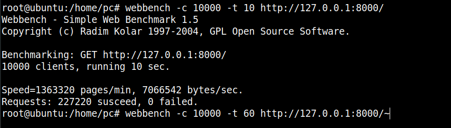
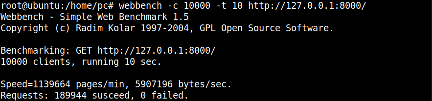
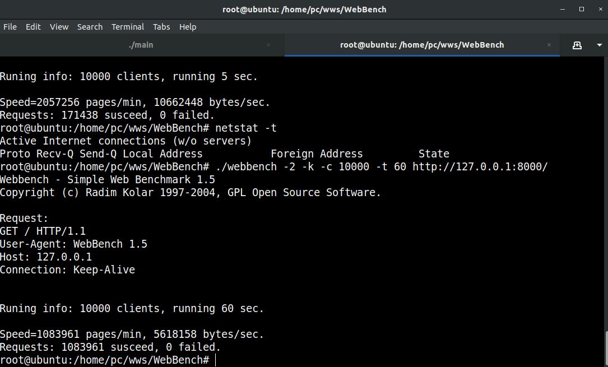
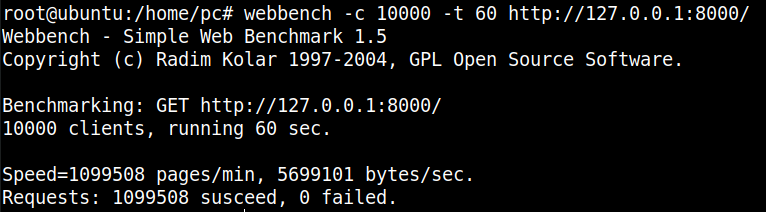

# 测试

## 准备

1. 原版的Webbench是不支持长连接的，需要改写，我用了https://github.com/linyacool/WebBench这个大佬改写的
2. 用ulimit查看系统允许打开的文件描述符、进程数量上限、core文件大小，我用的Ubuntu18.04默认值是不够的，直接改了个10万的文件描述符和进程数量无限制；不然用webbench并发数一多就会Resources temporarily unavailable

## 测试

先简单测测，可以用浏览器或者curl，看看功能是否正常；复杂一点可以用wireshark抓包看看生成的报文是否正确；这里就测测复杂页面、错误请求、传输大文件等功能是否正常

## 压力测试

多线程编程，很多问题一并发就凸显出来了，这也是最折磨人的部分，如果你的设计有问题不能保证线程安全，比如对容器不加锁并发地读写，那到一定并发数量后就会出现内存泄漏的问题。

并发测试不要连续进行，测试完用netstat -t可以查看系统的TCP链接，你会发现有很多TIME_WAIT状态的链接，这样会对下次测试的结果造成影响。

通过回环地址测试的，看了乐乎就好

长连接10000并发10s

短链接10000并发10s

长连接10000并发60s

短连接10000并发60s
